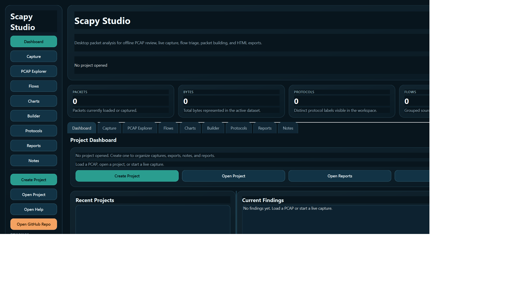
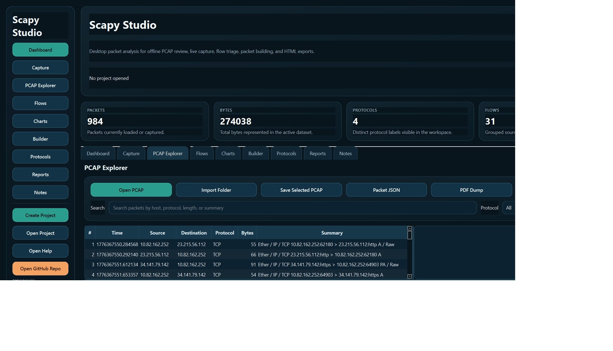

# Scapy Studio

Scapy Studio is a Windows desktop analysis workspace built around the Scapy codebase. It provides a polished GUI for offline PCAP review, live capture, session analysis, packet building, protocol inspection, and export generation.

- GitHub: [github.com/Ayman-Elbanhawy/ScapyStudio](https://github.com/Ayman-Elbanhawy/ScapyStudio)
- Website: [SoftwareMile.com](https://softwaremile.com)
- Support: [Github@Softwaremile.com](mailto:Github@Softwaremile.com)

## GUI Preview

### Dashboard



### PCAP Explorer



## What It Does

- Load and inspect `.pcap` and `.pcapng` files
- Import folders full of captures into a reusable project workspace
- Review packet metadata, decoded packet details, and raw hex
- Group traffic into source/destination/protocol flows
- Start and stop live capture through Scapy and Npcap on Windows
- Build local TCP and UDP packets for testing and inspection
- Export HTML reports, JSON, CSV findings, and project ZIP archives
- Keep local notes and project metadata in SQLite

## Desktop Workflow

1. Run `StartMe.bat` from the repo root.
2. Create or open a `.scapyproj` project if you want captures, notes, and exports grouped together.
3. Open a PCAP or import a folder of captures.
4. Review the dashboard cards, findings, explorer grid, flow table, and charts.
5. Use the builder and protocol browser when you need packet crafting or quick layer inspection.
6. Export reports, findings, and sessions from the Reports or Flows workspaces.

## Startup

### Recommended

Run:

```bat
StartMe.bat
```

The launcher:

- creates `.venv` if needed
- installs the editable Scapy repo plus desktop dependencies
- compiles the `scapy_studio` package
- checks for Npcap on Windows
- downloads the latest Npcap installer if it is missing
- launches the GUI

### Dependencies

- **Python 3.11+** is required
- **Npcap** is optional for offline analysis, but required for live capture on Windows
- `requirements-studio.txt` installs the desktop UI and reporting packages used by Scapy Studio

`StartMe.bat` uses generic variables rather than hard-coded machine paths:

- `APP_NAME`
- `APP_ROOT`
- `APP_SOURCE`
- `APP_VENV`
- `READY_MARKER`
- `DOWNLOAD_ROOT`
- `NPCAP_INSTALLER`
- `NPCAP_URL`

If Npcap is not installed, the launcher downloads the installer into `.downloads` and opens it. You can continue using offline PCAP analysis even before Npcap is installed.

## Manual Launch

```powershell
py -3.11 -m venv .venv
.venv\Scripts\python -m pip install --upgrade pip setuptools wheel
.venv\Scripts\python -m pip install --no-build-isolation -e .
.venv\Scripts\python -m pip install -r requirements-studio.txt
.venv\Scripts\python -m scapy_studio
```

## Repository Layout

- `scapy_studio/main.py`: Desktop window, theme, and workflow orchestration
- `scapy_studio/analysis.py`: Packet normalization, metrics, and packet export helpers
- `scapy_studio/workers.py`: Background PCAP and live capture workers
- `scapy_studio/reports.py`: HTML/CSV/JSON export helpers
- `docs/help/index.html`: Professional HTML help with menu sections and screenshots
- `StartMe.bat`: Windows dependency bootstrap and launcher

## Help

The repo includes a local HTML help document with setup guidance, screenshots, workflow documentation, support details, and export notes.

- open `docs/help/index.html` directly, or
- use the **Open Help** button inside the GUI

## Notes On Live Capture

- Live capture depends on Scapy being able to access a working Windows capture stack
- On Windows, that usually means installing Npcap
- If capture fails, run the app as Administrator and confirm the correct adapter was selected

## License

The governing legal license text remains in the root [`LICENSE`](LICENSE) file. The repository also includes a GitHub-facing [`LICENSE.md`](LICENSE.md) notice that points to the canonical license text without changing it.
